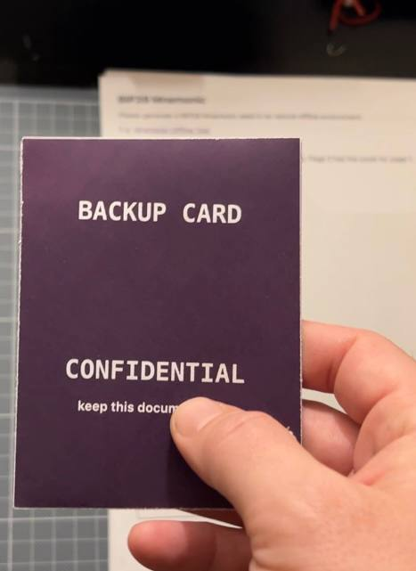
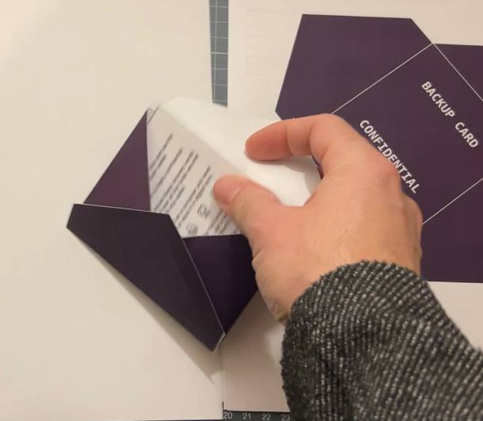
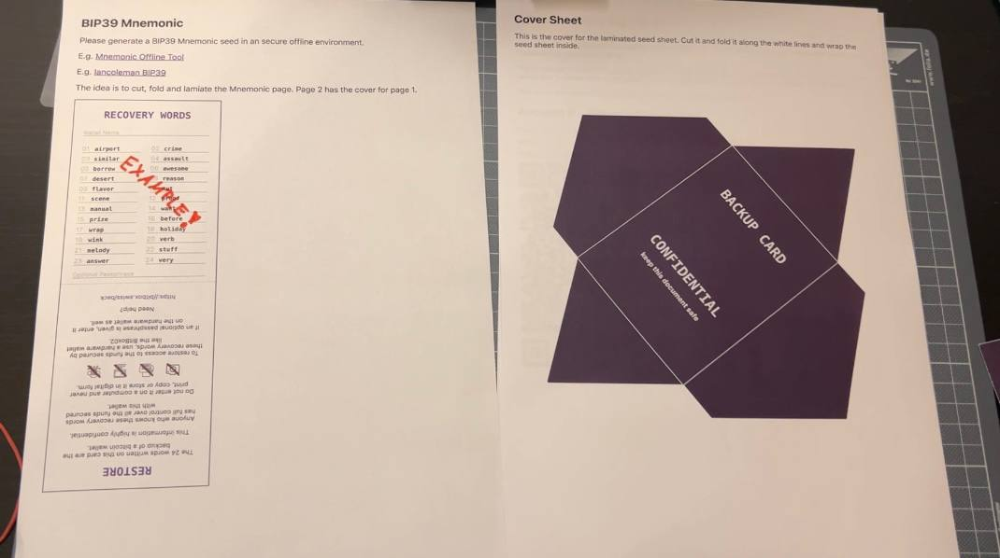
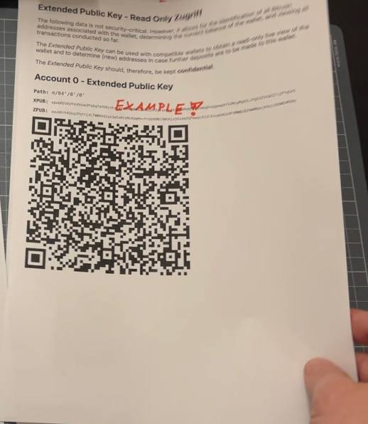
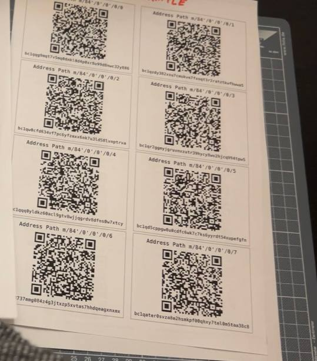

# Backup Card Creator

Creates from a mnemonic (BIP39) printable sheets for:
- backup card of the mnemonic for lamination
- cover sheet for the backup card 

- the zpub with QR code for account 0 `m/84'/0'/0'`

- Sheet with 8 addresses (and a button to produce more)

For a single page offline version either run `npm run build` or download the latest 
`backup-card-offline.html` from the [releases](https://github.com/thespielplatz/BackupCard/releases).

### Print sizes
- Backup Card Sheet: `70mm` x `95mm`
- Size inside of Cover sheet: `80mm` x `105mm`
- 
> [!CAUTION]
> This tool is designed to enhance the aesthetics of your backup seed cards for digital wallets, making them more visually appealing for printing. While it serves to facilitate a more organized and potentially more secure way to store your seed phrases, it's crucial to remember that you are still operating within a digital environment.
>
> Before using this tool to print your seed phrases, please ensure you are in a secure environment. Digital tools, no matter how robust, can have vulnerabilities ("attack angles"), including but not limited to those that might affect this project.

## Freezer | Linux in RAM 

The idea is to use this in a safe environment: e.g. 
- small linux loaded in RAM without hdd or pendrive, so no data is persisted see [Freezer](freezer/README.md)
- computer without hdd and network hardware
- USB Printer without network capabilities
  - ... and please research, if the printer save the last printouts
  - ... and please research, if "some time" power is enough to clear the printers memory
- To produce a mnemonic seed in a secure environment you could use [Mnemonic Offline Tool](https://github.com/bitaps-com/mnemonic-offline-tool)
or [Iancoleman BIP39](https://github.com/iancoleman/bip39/blob/master/readme.md#standalone-offline-version).

> [!NOTE]
> In my personal quest to mitigate risks, I conducted thorough research on my printer to understand how to reset its internal RAM, ensuring that no data remains stored after use. Additionally, I opted for a printer devoid of WLAN capabilities to further reduce the risk of unauthorized access.
> Consider Hardware Security: Use a computer and a printer without wireless connectivity features or hard drive to minimize the risk of e.g. network-based attacks.

## Disclaimer

> [!NOTE]
> THE SOFTWARE IS PROVIDED "AS IS", WITHOUT WARRANTY OF ANY KIND, EXPRESS OR IMPLIED, INCLUDING BUT NOT LIMITED TO THE WARRANTIES OF MERCHANTABILITY, FITNESS FOR A PARTICULAR PURPOSE AND NONINFRINGEMENT. IN NO EVENT SHALL THE AUTHORS OR COPYRIGHT HOLDERS BE LIABLE FOR ANY CLAIM, DAMAGES OR OTHER LIABILITY, WHETHER IN AN ACTION OF CONTRACT, TORT OR OTHERWISE, ARISING FROM, OUT OF OR IN CONNECTION WITH THE SOFTWARE OR THE USE OR OTHER DEALINGS IN THE SOFTWARE.
